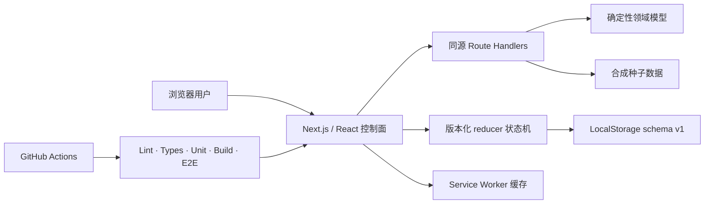
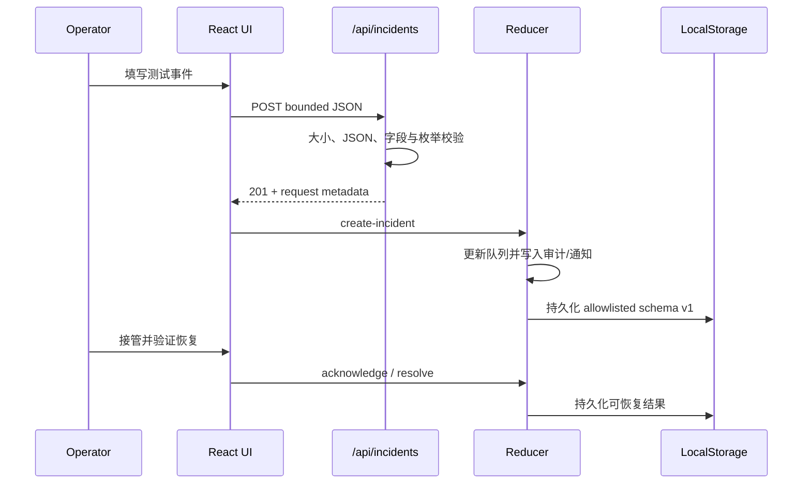

# NEXUS-7 系统架构

## 系统上下文

这一结构刻意保持“零密钥可运行”：真实基础设施、模型供应商、数据库和消息系统都没有被暗中模拟为外部依赖。浏览器看到的每条记录都可追溯到种子数据、API 响应或本地状态机动作。

## 关键用户旅程

## 分层职责

### 展示层

`components/views/*` 负责七个业务工作区。可访问名称、键盘命令、移动抽屉、明暗主题和紧凑密度在共享 shell 中实现，避免每个页面重复建立导航语义。

### 领域状态层

`lib/reducer.ts` 是所有客户端可变状态的单一入口。事件接管、解决、工作流运行、回滚、功能开关和偏好变化都通过判别联合 action 进入 reducer；副作用只在 React effect 层完成。

持久化使用显式白名单：通知和审计运行态不会被盲目反序列化，未知 `schemaVersion` 会被拒绝。导入使用同一条 schema 边界。

### API 层

`lib/api.ts` 提供：

- 统一 envelope 和请求追踪 ID；
- `Cache-Control: no-store` 与合成数据标记；
- 4 KB 请求体上限；
- 可预测的 400、413、422 与 405 失败语义。

### AI 层

当前 NEXUS AI 是确定性的领域分类器。它对输入做空白规范化和 500 字符截断，只能返回说明、置信度、证据列表及 allowlist 内的页面导航。它不访问网络、密钥或执行器。

### 离线层

正式构建注册 `public/sw.js`。策略是同源 GET 的 network-first、runtime cache fallback，并为根 shell、manifest 和图标预缓存。测试会在 Service Worker 获得控制权后切断网络并重新加载页面。

## 安全架构

- 默认 CSP、禁止 iframe、MIME sniffing 防护、受限权限策略和严格 referrer policy。
- 正式环境 CSP 不启用 `unsafe-eval`；开发环境仅为调试运行时放开。
- React 默认文本转义；没有 `dangerouslySetInnerHTML`。
- 所有外部效果被替换为合成、可逆、本地动作。
- 无仓库密钥；未来集成必须使用 Vercel 环境变量或 OIDC，而不是提交 `.env`。

## 生产化替换点

| 当前实验适配器 | 生产替换 | 新增强制控制 |
| --- | --- | --- |
| LocalStorage | Postgres/事务存储 | 租户键、RLS、迁移、备份恢复 |
| 无登录 | OIDC/企业 SSO | MFA、RBAC、会话撤销、审计 |
| 确定性 AI | AI Gateway/模型路由 | 提示注入防护、预算、评测、人工审批 |
| 合成工作流 | Durable workflow/queue | 幂等、重试、死信、并发与取消 |
| 模拟回滚 | 部署平台 API | 环境保护、双人审批、健康门、自动回退 |
| 本地审计 | 追加写审计仓 | 防篡改、保留策略、导出权限 |
| 单实例 API | 带限流的边缘/API 层 | 身份、速率限制、WAF、滥用检测 |

## 已知架构边界

此版本没有证明真实数据库一致性、跨区域故障转移、真实身份隔离、支付正确性或第三方 API 契约。它为这些能力预留了边界，但不能替代生产级威胁建模和容量验证。
